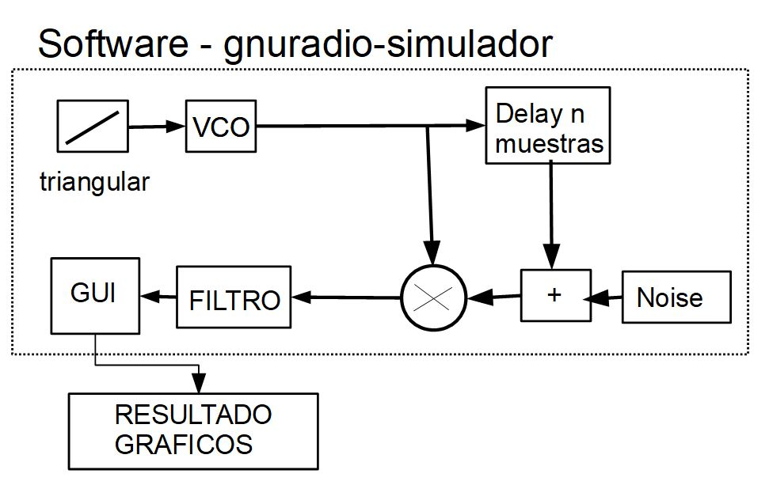
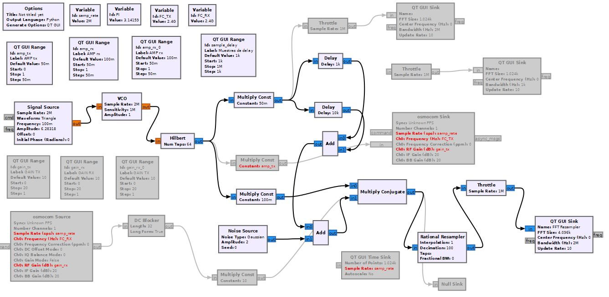
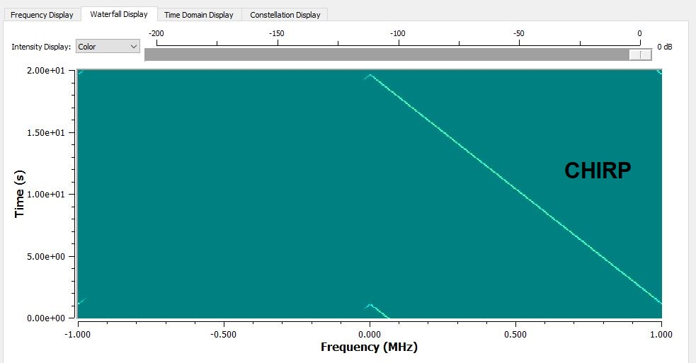
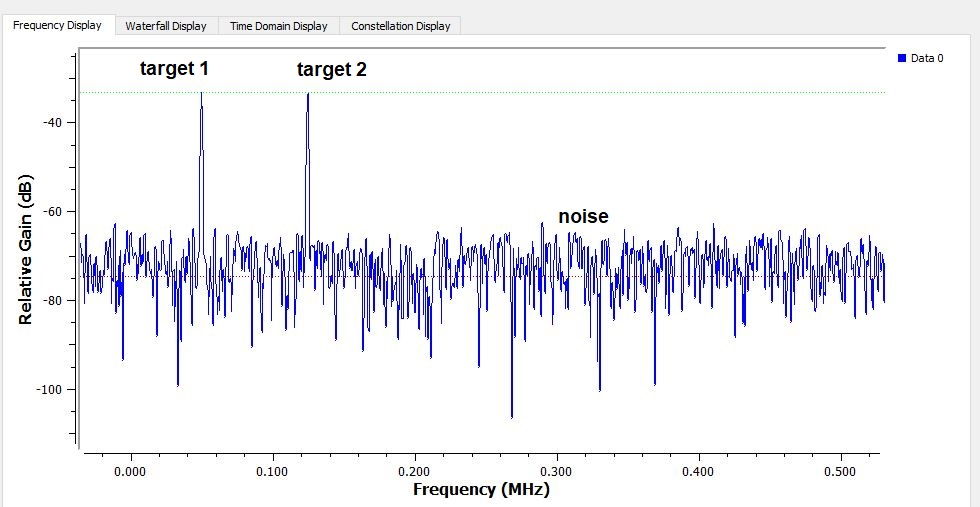

### Diagrama en bloques Simulador de un radar fmcw

### Simulador de un radar fmcw realizado con gnuradio

- [x] **Fc = 2.4 GHz**
- [x] **BW = 1 MHz**
- [x] **2 targets representado por Delay**
- [x] **Noise gaussian**\
El diagrama en bloques que simula un radar fmcw es el siguiente

### Chirp transmitida 
El espectrograma obtenido de la señal chirp transmitida es

### Eco targets
El resultado que se obtuvo con dos targers repesentados por *delays* es el siguiente. Donde se puede observar dos pulsos en frecuencias

